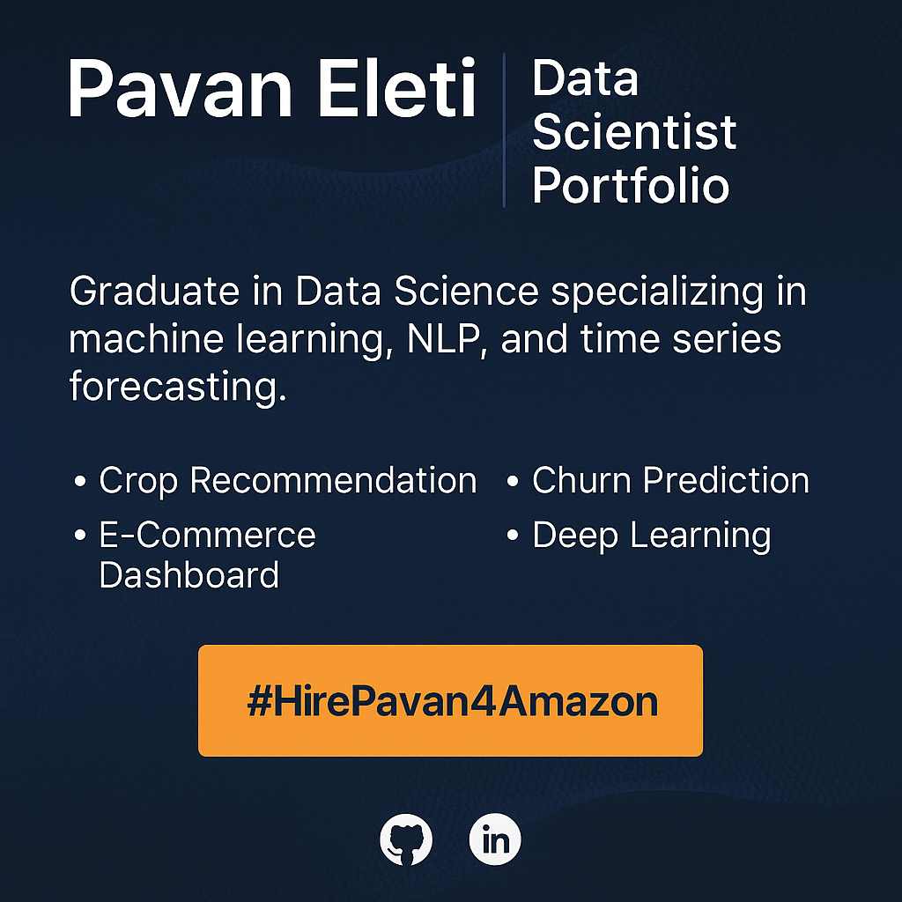

# 🌐 Pavan Eleti | Data Scientist Portfolio



Welcome to the official repository of my personal portfolio website [**pavaneleti.me**](https://pavaneleti.me), built to showcase my data science skills, machine learning projects, technical strengths, and passion for solving real-world business problems — with a focus on Amazon-style impact.

---

## 🚀 About Me

I'm a data science graduate with hands-on experience in:

- 📊 Machine Learning & Statistical Modeling  
- 🧠 Natural Language Processing (NLP)  
- 📈 Time Series Forecasting  
- ☁️ Cloud Tools: AWS, GCP  
- 📌 Tools: Python, SQL, TensorFlow, PyTorch, Scikit-learn, Power BI, Tableau

Currently seeking **L4 Data Scientist roles** in product or operations analytics with companies like **Amazon** — aiming for ₹20–28 LPA.

---

## 🖥️ Website Features

- ⚡ **Built with Next.js 14, TailwindCSS & Framer Motion**
- 🧩 Fully responsive design (mobile + desktop)
- 💼 Featured Projects with filtering + detail modals
- 🎯 SEO optimized + OpenGraph & Twitter metadata
- 🗺️ Dynamic `sitemap.xml` & robots.txt
- 💌 Contact Form via Formspree integration
- 🌙 Dark mode toggle
- 🧠 Custom Amazon-inspired floating CTA: `#HirePavan4Amazon`
- 🧾 JSON-LD schema for Google search visibility

---

## 📂 Project Structure

```bash
├── app/
│   ├── layout.tsx           # Global layout with metadata + JSON-LD schema
│   ├── page.tsx             # Home page sections (Hero, Projects, Skills, Contact)
│   └── sitemap/route.ts     # Dynamically generated sitemap
├── components/
│   ├── Hero.tsx
│   ├── Projects.tsx
│   ├── ProjectModal.tsx
│   ├── Skills.tsx
│   ├── Contact.tsx
│   ├── Footer.tsx
│   └── Navbar.tsx
├── public/
│   └── images/              # Profile & Amazon icon assets
├── styles/
│   └── globals.css
├── next.config.js
└── README.md
